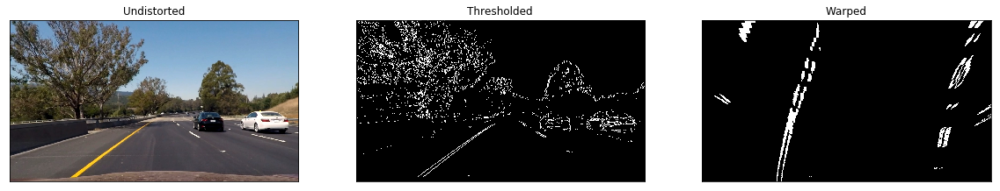

# Advanced Lane Detection

by Mas Chano (Feb 2017 Cohort)

### Project Information
This repository contains my implementation of the Advanced Lane Finding project for the Udacity Self-Driving Car Engineer Nanodegree (original Udacity project repo can be found [here](https://github.com/udacity/CarND-Advanced-Lane-Lines)). 

### Project Goals

The goals / steps of this project are the following:

* Compute the camera calibration matrix and distortion coefficients given a set of chessboard images.
* Apply a distortion correction to raw images.
* Use color transforms, gradients, etc., to create a thresholded binary image.
* Apply a perspective transform to rectify binary image ("birds-eye view").
* Detect lane pixels and fit to find the lane boundary.
* Determine the curvature of the lane and vehicle position with respect to center.
* Warp the detected lane boundaries back onto the original image.
* Output visual display of the lane boundaries and numerical estimation of lane curvature and vehicle position.

### Description of Files

The repository contains the following files/directories:

| File / Directory  | Description                                                                          |
| ---               | ---                                                                                  |
| camera_cal/       | Checkerboard images used to calibrate camera                                         |
| test_images/      | Sample images used to test lane finding image processing pipeline                    |
| test_images_seq/  | Sample images used to test lane finding image processing pipeline                    |
| test_videos/      | Original highway driving video files.                                                |
| [output_files/](https://github.com/mchano/CarND-P04-Advanced-Lane-Lines/tree/master/output_files)  | Resulting video files overlaid with detected lanes.                                  |
| [writeup.ipynb](https://github.com/mchano/CarND-P04-Advanced-Lane-Lines/blob/master/writeup.ipynb) | Jupyter notebook that contains the lane finding pipeline and summary of the results. |
| [writeup.md](https://github.com/mchano/CarND-P04-Advanced-Lane-Lines/blob/master/writeup.md) | Markdown version of Jupyter Notebook `writeup.ipynb` |
